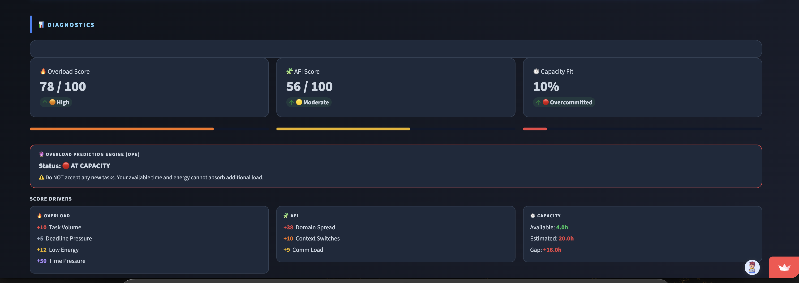
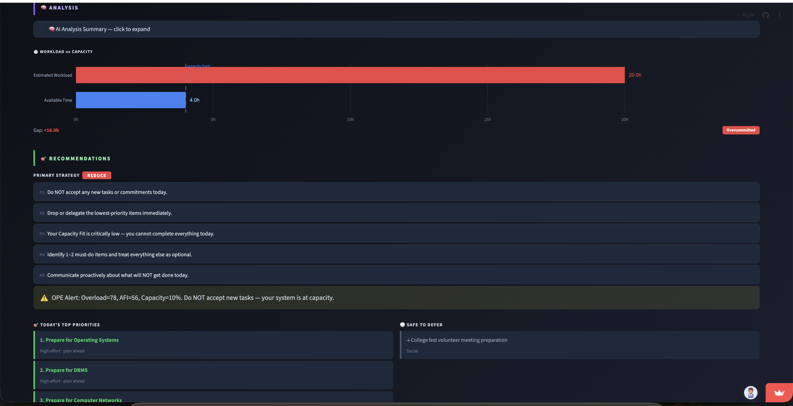

# 🧠 Digital Overload AI
### AI-Powered Student Workload Intelligence Platform

> **Understand your workload pressure before your day falls apart — not after.**

[](https://github.com/Jagadeesh0463/digital-overload-ai/actions/workflows/tests.yml)


🌐 **Live App:** https://digital-overload-ai.streamlit.app

📂 **GitHub:** https://github.com/Jagadeesh0463/digital-overload-ai

---

## ✨ Highlights

| Feature | Description |
|---------|-------------|
| 🤖 AI-Powered Analysis | Groq Llama 3.3 70B extracts 8 workload signals from plain text |
| 📊 3 Diagnostic Scores | Overload Score · Attention Fragmentation Index · Capacity Fit |
| 💡 Explainable Recommendations | 16-row deterministic rule matrix → FOCUS / DEFER / SPLIT / REDUCE |
| 🔍 Overload Signal Detection | Named pattern recognition across tasks, energy, time, and messages |
| 🗓️ AI Day Planner | Energy-adjusted time blocks grouped by domain priority |
| ✅ 32 Automated Tests | 13 scoring tests + 19 recommender tests, all passing |

---

## Overview

Digital Overload AI is an AI-assisted workload analysis platform designed to help students
understand task pressure, fragmented attention, and planning risk before committing to their day.

The platform converts natural-language workload descriptions into measurable diagnostics
and provides structured prioritization recommendations — powered by Groq's Llama 3.3 70B model.

**Problem it solves:** Students often feel constantly busy but fail to make meaningful progress
due to excessive context switching, unrealistic scheduling, and fragmented digital attention.
This platform makes those hidden patterns visible and actionable.

**Target users:** College students juggling assignments, club commitments, messages, and
personal tasks with limited available hours.

---

## 🔬 Try This Example

Paste this into the app to see a full analysis:

```
4 assignments due this week — ML project, OS lab report, DSA quiz prep, and English essay.
18 WhatsApp messages pending from group chats.
Club meeting tomorrow needs slide preparation.
Low energy today — slept 4 hours.
Only 3 free hours tonight.
```

**Expected outcome (approximate):**
- Overload Score: 60–70 &nbsp;•&nbsp; AFI: 50–60 &nbsp;•&nbsp; Capacity Fit: <40%
- Likely Recommendation: **REDUCE**

---

## 🧩 What is the Attention Fragmentation Index (AFI)?

AFI is an **original metric** that measures cognitive scatter caused by switching between
unrelated task domains within a single day.

Most workload tools count tasks. AFI measures *how spread out* those tasks are:

```
AFI = (Domain Spread × 0.50) + (Context Switches × 0.30) + (Message Load × 0.20)

AFI  0–35  → Low      (focused day, minimal switching)
AFI 36–60  → Moderate (some fragmentation — manageable)
AFI 61–80  → High     (significant switching — productivity affected)
AFI 81–100 → Severe   (overrides everything → SPLIT strategy)
```

**Why it matters:** A student with 3 tasks across 3 unrelated domains (Academic + Social + Admin)
experiences more cognitive cost than one with 5 tasks all in the same domain — even if the
total hours are identical. AFI captures this invisible overhead.

---

## 🔮 Overload Prediction Engine (OPE)

OPE is a **pre-acceptance check**: before saying yes to a new commitment, the system
predicts whether your current load can absorb it.

```
OPE produces one of three states:

  🔴 AT CAPACITY  → Cap < 40%  OR  AFI > 80
                    Do NOT accept any new tasks. System is at its limit.

  🟠 AT RISK      → Overload > 65  AND  Capacity < 70%
                    Proceed carefully — one extra task could tip you into overload.

  🟢 MANAGEABLE   → Neither of the above conditions met
                    Load is within range. Monitor before accepting new tasks.
```

Unlike a simple threshold alert, OPE cross-references all three scores simultaneously
to determine whether the system as a whole is at capacity — not just one dimension.

---

## 🚀 Why This Project Is Different

Unlike rule-based workload managers that operate on pre-entered task lists,
Digital Overload AI uses a **Groq LLM (Llama 3.3 70B)** to extract workload signals
from free-text natural language — the way students actually describe their day.

The system then combines **AI extraction** with **deterministic scoring** and a
**rule-based recommendation engine** — providing the explainability of a rule system
with the flexibility of an AI front-end.

Key differentiators:

- **No form-filling** — paste a natural description, get a full diagnostic
- **Three independent scores** — each captures a different dimension of overload
- **Attention fragmentation as a first-class metric** — not just task count
- **OPE pre-acceptance check** — proactive, not reactive
- **Fully deterministic recommendations** — traceable, not a black box

---

## 📐 How Scores Are Calculated

### Overload Score (0–100)

Measures total workload pressure, including time gap between what needs to be done and what time exists.

```
Overload = (Task Volume      × 0.15)
         + (Urgency Signals  × 0.20)
         + (Energy Penalty   × 0.15)   ← (1 - energy_norm)
         + (Time Pressure    × 0.50)   ← (est_hours / free_hours) / 4.0, capped at 1.0

Time Pressure is the dominant factor (50%) because the ratio of estimated
work to available time is the most objective overload signal.
  2:1 ratio (6h work / 3h free) → time_pressure = 0.50
  4:1 ratio (12h work / 3h free) → time_pressure = 1.00

Labels:   0–40 = Low · 41–65 = Moderate · 66–85 = High · 86–100 = Critical
```

### Attention Fragmentation Index — AFI (0–100)

```
AFI = (Unique Domains     × 0.50)
    + (Context Switches   × 0.30)
    + (Pending Messages   × 0.20)

Labels:   0–35 = Low · 36–60 = Moderate · 61–80 = High · 81–100 = Severe
```

### Capacity Fit (0–100%)

```
Capacity Fit = (free_hours / estimated_hours) × energy_multiplier × 100

Energy multipliers: High = 1.0 · Medium = 0.75 · Low = 0.5

Labels:   ≥100% = Good Fit · 70–99% = Tight · 40–69% = Poor Fit · <40% = Overcommitted
```

---

## 🗺️ System Flow

```
Student Input (natural language)
            │
            ▼
   ┌─────────────────────┐
   │  Groq Llama 3.3 70B │
   │  (Feature Extractor) │
   └─────────────────────┘
            │
            ▼
   8 Structured Signals:
   task_count · urgency_signals · unique_domains
   context_switches · pending_messages
   energy_level · free_hours · estimated_hours
            │
            ▼
   ┌──────────────────────────────────┐
   │          Scoring Engine          │
   │  Overload │  AFI  │ Capacity Fit │
   └──────────────────────────────────┘
            │
            ▼
   ┌──────────────────────────────────┐
   │    16-Row Recommendation Matrix  │
   │    FOCUS · DEFER · SPLIT · REDUCE│
   └──────────────────────────────────┘
            │
            ▼
   ┌──────────────────────────────────┐
   │       Day Planner Engine         │
   │   Domain-grouped time blocks     │
   └──────────────────────────────────┘
            │
            ▼
   Streamlit Dashboard
   (4-section results: Diagnostics · Analysis · Recommendations · Planning)
```

---

## Key Features

- **3-Score Diagnostic** — Overload Score + AFI + Capacity Fit computed independently
- **Detected Overload Signals** — pattern identification across task volume, messages, energy, capacity
- **AI Analysis Summary** — natural-language explanation of what's driving the scores
- **Score Drivers** — per-contributor breakdown showing exactly what pushed each score
- **Workload vs Capacity** — visual comparison bars + gap analysis
- **Top Priorities + Safe to Defer** — AI-sorted task recommendations
- **Time-Block Day Planner** — domain-grouped schedule with energy-adjusted block lengths
- **OPE Alert** — real-time overload prediction before accepting new tasks
- **Session History** — last 5 analyses with overload trend sparkline
- **CSV Export** — download full analysis results
- **3 Demo Profiles** — one-click student scenarios

---

## Tech Stack

| Layer      | Technology                   |
|------------|------------------------------|
| Frontend   | Streamlit       |
| Backend    | Python          |
| AI / NLP   | Groq API        |
| Charts     | Plotly          |
| Testing    | pytest          |
| Deployment | Streamlit Cloud |

---

## Project Structure

```
digital-overload-ai/
├── app.py                   Main Streamlit dashboard
├── groq_client.py           Groq AI — extracts 8 features from plain text
├── scoring_engine.py        Overload, AFI, Capacity Fit formulas
├── recommender.py           16-row rule matrix + action plan generator
├── day_planner.py           Domain-grouped time-block schedule builder
├── session_store.py         Session history — last 5 analyses
├── utils.py                 Constants, thresholds, colour maps
├── tests/
│   ├── test_scoring.py      13 unit tests for scoring formulas
│   └── test_recommender.py  19 unit tests for rule matrix
├── docs/
│   ├── PROJECT_OVERVIEW.md  Deep explanation of all concepts
│   ├── SAMPLE_INPUTS.md     3 student personas with expected outputs
│   └── EXTENSION_IDEAS.md   Future upgrade paths with code
├── CHANGELOG.md
├── CONTRIBUTING.md
├── requirements.txt
└── .env.example
```

---

## 📸 Screenshots

<p align="center">
  
  <br/>
  <sub><b>Input Screen</b> — Paste any natural-language workload description. No forms, no checkboxes.</sub>
</p>

---

<table>
  <tr>
    <td align="center" width="50%">
      
      <br/>
      <sub><b>3-Score Diagnostic Dashboard</b><br/>Overload Score · AFI · Capacity Fit with severity labels</sub>
    </td>
    <td align="center" width="50%">
      
      <br/>
      <sub><b>Detected Signals & AI Analysis</b><br/>Overload patterns grouped by severity · AI plain-English summary</sub>
    </td>
  </tr>
</table>

<table>
  <tr>
    <td align="center" width="50%">
      
      <br/>
      <sub><b>Recommendations & Priority Plan</b><br/>FOCUS / DEFER / SPLIT / REDUCE strategy with per-task reasoning</sub>
    </td>
    <td align="center" width="50%">
      
      <br/>
      <sub><b>AI Day Planner</b><br/>Urgency-sorted time blocks · smart breaks · deferred task list</sub>
    </td>
  </tr>
</table>

> Screenshots captured from the live application and stored in `docs/screenshots/`.

---

## How to Run Locally

**Step 1 — Clone the repo**
```bash
git clone https://github.com/Jagadeesh0463/digital-overload-ai.git
cd digital-overload-ai
```

**Step 2 — Create virtual environment**
```bash
python3 -m venv venv
source venv/bin/activate
```

**Step 3 — Install dependencies**
```bash
pip install -r requirements.txt
```

**Step 4 — Add your Groq API key**
```bash
cp .env.example .env
# Open .env and paste your key:
# GROQ_API_KEY=your_groq_key_here
```

**Step 5 — Run the app**
```bash
streamlit run app.py
```

> **Note:** The live Streamlit Cloud deployment may take 30–60 seconds to wake up on first visit (cold start). Click "Yes, get this app back up!" if prompted.

**Step 6 — Run all tests**
```bash
pytest tests/ -v
```

---

## Test Results

```
pytest tests/ -v

test_scoring.py      — 13 passed
test_recommender.py  — 19 passed
─────────────────────────────────
Total                — 32 passed in 0.02s
```

---

## Limitations

- Results depend on honest self-reported input
- NOT a medical, psychological, or mental health diagnostic system
- Scores are estimates from weighted formulas — not exact cognitive measurements
- Recommendation engine uses a deterministic rule matrix, not personalised ML
- Session history resets when the browser tab is closed
- Requires internet connection for Groq API calls

---

## Future Enhancements

- Gmail and Calendar auto-import of daily commitments
- Weekly AFI trend tracking and overload reports
- Mobile app with push notification support
- ML-based recommendation engine replacing the rule matrix

---

## 📊 Project Metrics

| Metric | Value |
|--------|-------|
| Automated Tests | 32 (13 scoring + 19 recommender) |
| Recommendation Rules | 16 |
| Extracted Signals | 8 |
| Diagnostic Scores | 3 |
| Task Domains | 4 (Academic · Admin · Social · Personal) |
| AI Planning Engine | 1 (Groq Llama 3.3 70B) |

---

## 🎓 Key Learnings

- **LLM integration** — Using Groq API to extract structured data from free-text input
- **Explainable AI design** — Combining AI extraction with deterministic, traceable scoring
- **Rule-based decision systems** — Building a 16-row matrix that maps score combinations to actions
- **Automated testing** — Writing 32 pytest tests covering edge cases in scoring and recommendations
- **Streamlit deployment** — Building and deploying a multi-section data app on Streamlit Cloud
- **Metric design** — Creating original metrics (AFI, OPE, Capacity Fit) from first principles

---

## 📄 Resume Highlights

This project demonstrates:

- LLM integration using Groq API
- Explainable AI system design
- Custom metric engineering (AFI, OPE, Capacity Fit)
- Rule-based recommendation systems
- Automated testing with pytest
- Streamlit application deployment
- GitHub Actions CI workflow

---

## Disclaimer

This is a decision-support tool for workload planning only.
It is NOT a medical, psychological, or mental health diagnostic system.

---

## Author

**S Jagadeesh** — [GitHub @Jagadeesh0463](https://github.com/Jagadeesh0463)
