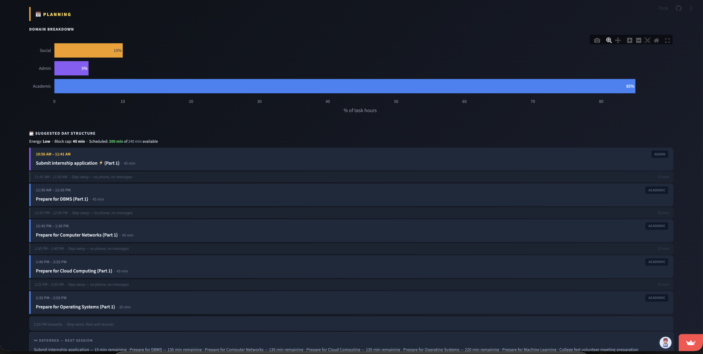

# 🧠 Digital Overload AI

**AI-powered workload analyzer for students — paste your day, get a full diagnostic.**

[](https://github.com/Jagadeesh0463/digital-overload-ai/actions/workflows/tests.yml)


**Live App →** https://digital-overload-ai.streamlit.app

---

## Overview

Digital Overload AI accepts a plain-text description of a student's workload and returns three diagnostic scores, a structured action plan, and an AI-assisted day schedule — no forms or manual data entry required.

It combines **LLM-based signal extraction** (Groq Llama 3.3 70B) with a **deterministic scoring engine** and a **16-row recommendation rule matrix**, keeping outputs explainable and traceable.

**Problem it addresses:** Students frequently underestimate workload pressure until it's too late to adjust. This tool surfaces hidden overload patterns — fragmented attention, time gaps, energy deficits — before the day begins.

---

## Key Features

- **Natural language input** — describe your day in plain text; no dropdowns or checklists
- **3 diagnostic scores** — Overload Score, Attention Fragmentation Index (AFI), Capacity Fit
- **Explainable recommendations** — 16-row rule matrix maps score combinations to FOCUS / DEFER / SPLIT / REDUCE
- **Overload Prediction Engine (OPE)** — pre-acceptance capacity check across all three scores
- **AI Day Planner** — urgency-sorted, domain-grouped time blocks with energy-adjusted durations
- **Signal detection** — named pattern recognition across tasks, deadlines, messages, and energy
- **Session history** — last 5 analyses tracked per session with trend sparkline
- **CSV export** — download complete analysis results
- **37 automated tests** — scoring, recommender, and planner coverage with CI on every push

---

## Screenshots

<p align="center">
  
  <br/>
  <sub>Full workload dashboard — input, scores, signals, recommendations, and day plan</sub>
</p>

<table>
  <tr>
    <td align="center" width="50%">
      
      <br/>
      <sub><b>3-Score Diagnostic</b> — Overload · AFI · Capacity Fit</sub>
    </td>
    <td align="center" width="50%">
      
      <br/>
      <sub><b>Signal Detection & AI Summary</b></sub>
    </td>
  </tr>
</table>

<p align="center">
  
  <br/>
  <sub>AI Day Planner — urgency-sorted blocks, smart breaks, deferred task list</sub>
</p>

---

## Tech Stack

| Layer | Technology |
|---|---|
| Frontend | Streamlit |
| Backend | Python 3.11 |
| AI / NLP | Groq API — Llama 3.3 70B |
| Charts | Plotly |
| Testing | pytest |
| CI | GitHub Actions |
| Deployment | Streamlit Cloud |

---

## Project Structure

```
digital-overload-ai/
├── app.py               Streamlit dashboard and UI
├── groq_client.py       Groq API integration — extracts 8 signals from plain text
├── scoring_engine.py    Overload Score, AFI, and Capacity Fit formulas
├── recommender.py       16-row rule matrix and action plan generator
├── day_planner.py       Domain-grouped time-block schedule builder
├── session_store.py     In-session history (last 5 analyses)
├── utils.py             Constants, thresholds, and colour maps
├── tests/               37 unit tests across scoring, recommender, and planner
├── docs/                Architecture, design docs, sample inputs, extension ideas
├── .github/workflows/   CI — runs full test suite on push and PR
├── requirements.txt
├── CONTRIBUTING.md
└── LICENSE
```

---

## Installation

```bash
git clone https://github.com/Jagadeesh0463/digital-overload-ai.git
cd digital-overload-ai
python3 -m venv venv
source venv/bin/activate        # Windows: venv\Scripts\activate
pip install -r requirements.txt
```

---

## Environment Variables

Create a `.env` file in the project root:

```bash
cp .env.example .env
```

| Variable | Description |
|---|---|
| `GROQ_API_KEY` | API key from [console.groq.com](https://console.groq.com) |

> Never commit `.env` — it is listed in `.gitignore`.

---

## Run Locally

```bash
streamlit run app.py
```

> **Streamlit Cloud cold start:** The hosted app may take 30–60 seconds to wake on first visit.

---

## Testing

```bash
pytest tests/ -v
```

```
tests/test_scoring.py       13 passed
tests/test_recommender.py   19 passed
tests/test_planner.py        5 passed
─────────────────────────────────────
Total                       37 passed in 0.03s
```

Tests cover normalisation edge cases, scoring formula accuracy, all 16 rule matrix combinations, AFI override logic, and day planner scheduling behaviour.

---

## Docs

| Document | Description |
|---|---|
| [Project Overview](docs/PROJECT_OVERVIEW.md) | Scoring formulas, AFI, OPE, and design rationale |
| [System Design](docs/SYSTEM_DESIGN.md) | Architecture, data flow, and module responsibilities |
| [Sample Inputs](docs/SAMPLE_INPUTS.md) | 3 student personas with expected score ranges |
| [Extension Ideas](docs/EXTENSION_IDEAS.md) | Gmail, Calendar, and ML engine upgrade paths with code |

---

## Future Improvements

- Gmail and Google Calendar integration for automatic input
- Persistent weekly AFI trend report
- ML-based recommendation engine trained on user feedback
- Mobile PWA with overload threshold push notifications

---

## Contributing

Contributions are welcome. Please read [CONTRIBUTING.md](CONTRIBUTING.md) before opening a pull request.

---

## License

[MIT](LICENSE) © S Jagadeesh
